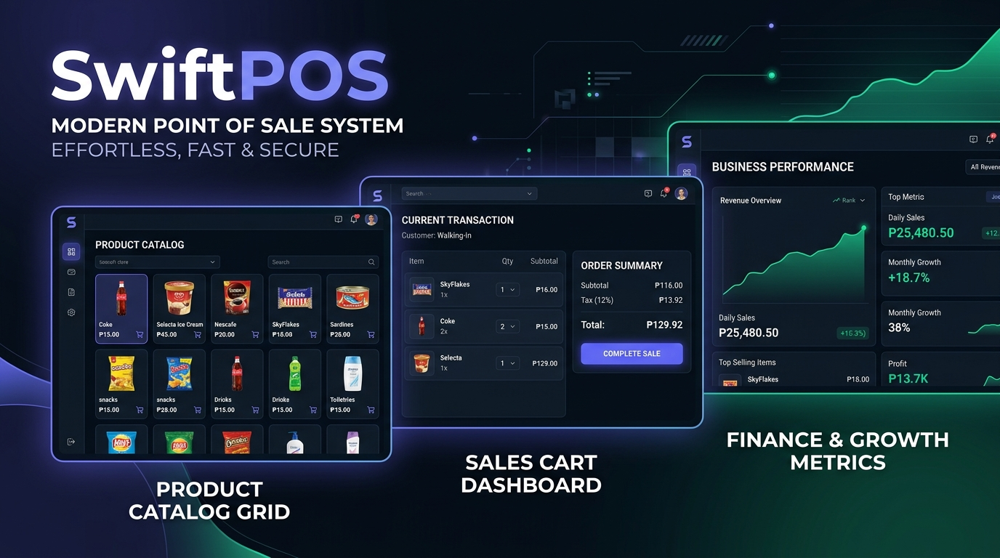

# SwiftPOS - Modern Point of Sale System



SwiftPOS is a modern, responsive, and lightweight Point-of-Sale (POS) web application designed specifically for small stores, market stalls, and sari-sari stores in the Philippines. It operates entirely in the browser, supports both mobile and desktop views, and includes built-in lending (utang) tracking, shift cash drawer audits, and financial growth analytics.

---

## 🚀 Key Features

*   **Point of Sale (Sales & Checkout):**
    *   Responsive product catalog grid populated with popular Philippine store products (Coke, Milo, Magic Sarap, Century Tuna, Rice, and Sugar).
    *   Visual "In-Cart Quantity" indicator badges and active click visual responses on product cards.
    *   Support for multiple units (pieces (`pcs`) and fractional kilograms (`Kg`)).
    *   Instant sales cart discount adjustments (₱).
    *   Trash bin buttons for one-click cart item removals.
*   **WordPress-Style Media Library:**
    *   Interactive visual gallery containing all local store graphic assets.
    *   Drag-and-drop file upload zone allowing users to add custom brand photos directly from their device.
*   **Lending / Utang Ledger:**
    *   Debt log tracking borrower accounts (unpaid balances).
    *   Register partial payments or full payouts that automatically clear debt balances and update store revenue records.
*   **Cashier Shift Audits:**
    *   Track starting register drawer cash.
    *   Active cashier shift session banner monitoring daily income.
*   **Financial & Profit Analytics:**
    *   Live metrics calculating Gross Income, Sold Capital Costs, Operational Expenses, and Net Profits.
    *   Timeframe filtering (Today, Week, Month, Year, and All-Time).
*   **Automated Receipt History:**
    *   Printable customer receipts preview.
    *   Expandable transaction history accordion and CSV spreadsheet exports.

---

## 🛠️ Tech Stack

*   **Backend:** Python 3.12+ (Flask, Flask-SQLAlchemy, Flask-Login)
*   **Frontend:** Vanilla JS (ES6+), Jinja2 templates, TailwindCSS
*   **Database:** SQLite (local relational file structure)

---

## 📦 Installation & Setup

1.  **Clone the Repository:**
    ```bash
    git clone https://github.com/phcodesage/Swift-Pos.git
    cd Swift-Pos
    ```

2.  **Create and Activate Virtual Environment:**
    ```bash
    python3 -m venv venv
    source venv/bin/activate
    ```

3.  **Install Dependencies:**
    ```bash
    pip install -r requirements.txt
    ```

4.  **Run the Live Web Server:**
    ```bash
    python app.py
    ```
    Open your browser and navigate to: **[http://127.0.0.1:5002/](http://127.0.0.1:5002/)**

---

## 🔐 Default Credentials

| Username | Password | Role | Description |
| :--- | :--- | :--- | :--- |
| `admin` | `admin123` | **Admin** | Full access to dashboard, finance, stocks, and cashier accounts. |
| `cashier` | `cashier123` | **Cashier** | Standard cashier sales register, lending, and shifts page. |

---

## 🎬 How to Capture a Live GIF of SwiftPOS
To record your own walkthrough animation of the SwiftPOS layout for GitHub:
1. Download a screen recording tool (such as **GIPHY Capture** or **LICEcap** for macOS).
2. Resize the recording frame over your browser window.
3. Perform a checkout, select a product, or open the WordPress-style Media Library.
4. Export the clip as an `.gif` and save it inside `static/images/demo.gif` to display it in this file.
